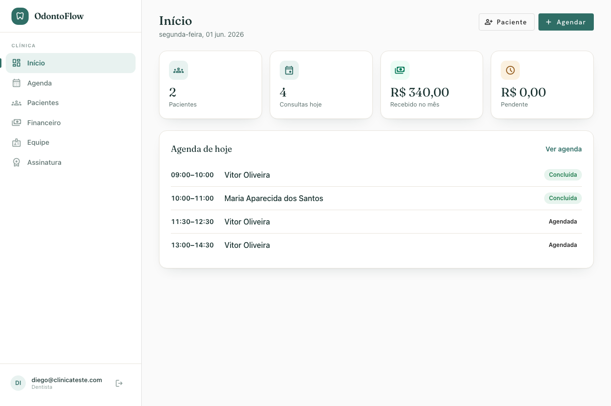
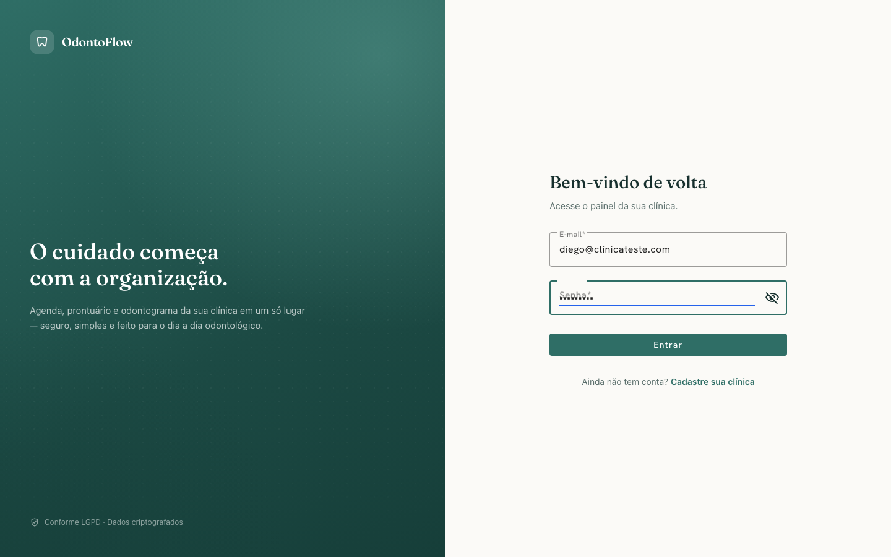
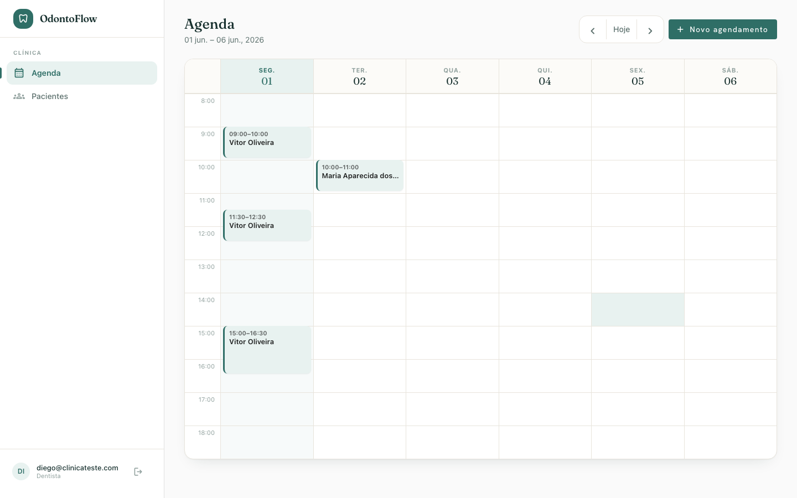
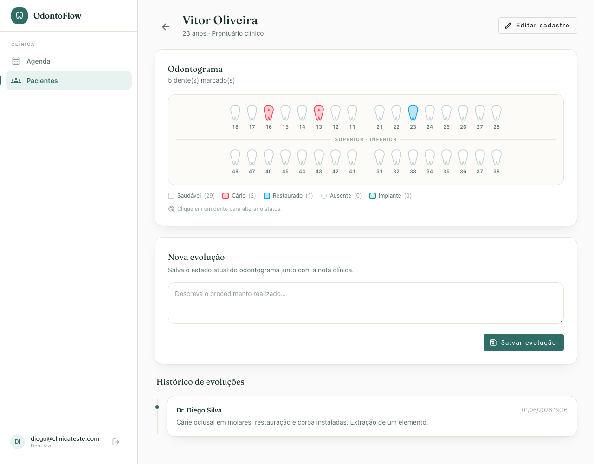
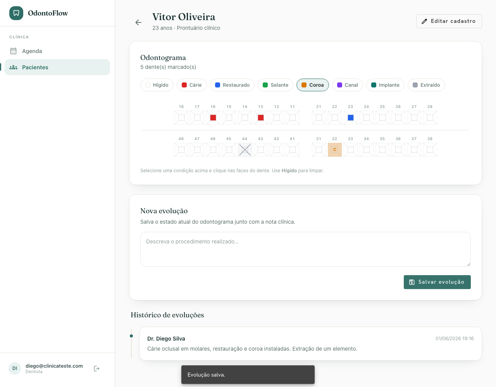
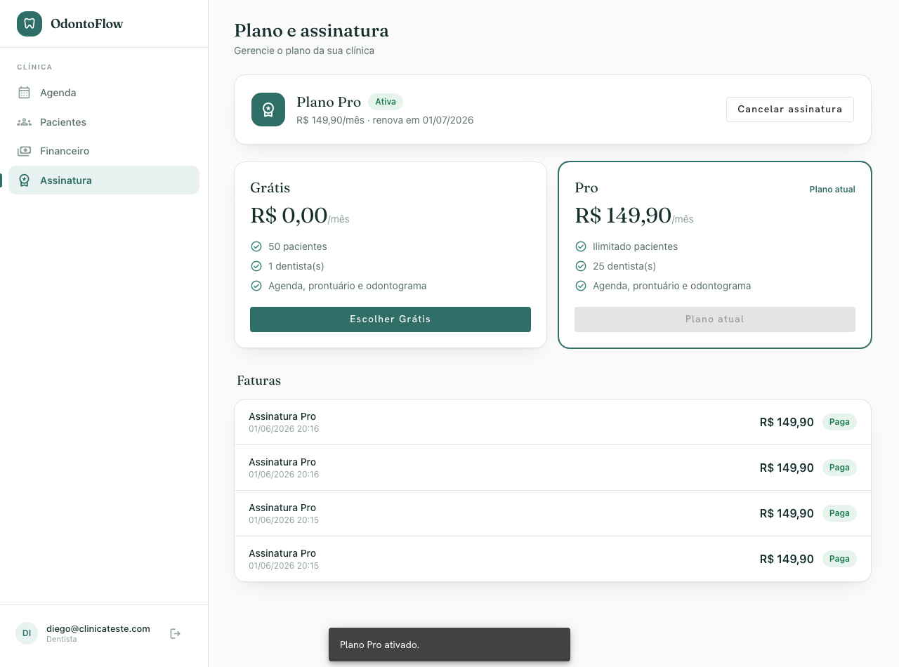
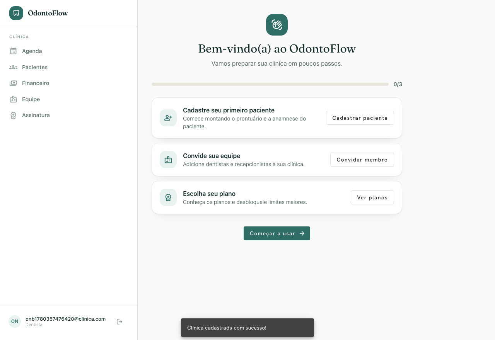
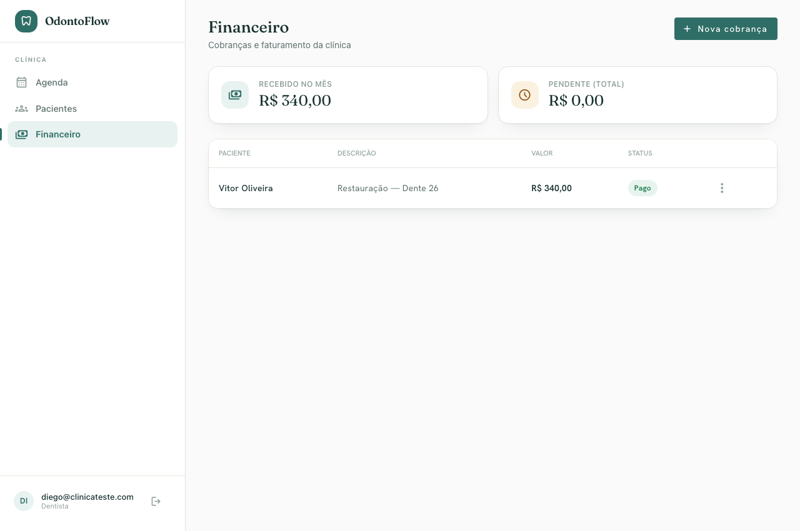
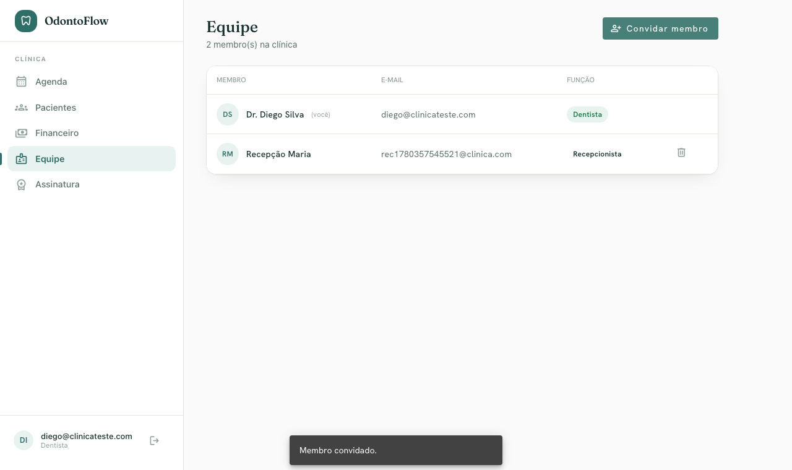

# 🦷 OdontoFlow — Frontend

> SPA em Angular para um SaaS odontológico multi-tenant: agenda com arrastar-e-soltar, odontograma interativo, prontuário, radiografias, financeiro e assinaturas.

**🌐 Idioma:** [English](README.md) · **Português 🇧🇷**


> ℹ️ **Projeto de portfólio.** Os textos da interface estão em pt-BR (produto brasileiro); o código, comentários e commits estão em inglês.

---

## Visão geral

O frontend do **OdontoFlow**, uma plataforma B2B para clínicas odontológicas. Funciona junto com a [API em Spring Boot](https://github.com/diegodinizm1/odontoflow-back) e apresenta um design system coeso e autoral — **"Clinical Calm"**: fundo em tom "papel" quente, acento em verde pinho profundo, tipografia de exibição **Fraunces** com **Hanken Grotesk** na interface, e ícones Material arredondados.

## Telas

| Dashboard | Login |
|-----------|-------|
|  |  |

| Agenda semanal (arrastar e soltar) | Odontograma interativo |
|------------------------------------|------------------------|
|  |  |

| Prontuário | Planos de assinatura |
|------------|----------------------|
|  |  |

<details>
<summary>Mais — onboarding, financeiro &amp; equipe</summary>

| Onboarding | Financeiro | Equipe |
|------------|------------|--------|
|  |  |  |

</details>

## Funcionalidades

- 📊 **Dashboard** — visão geral inicial com cards de KPI (pacientes, consultas de hoje, faturamento do mês, pendente) e a agenda do dia.
- 🔐 **Autenticação & onboarding** — login e cadastro da clínica em duas etapas, seguidos de um checklist guiado de configuração.
- 📅 **Agenda** — calendário semanal com blocos de consulta que você pode **arrastar e soltar para reagendar** (com checagem de sobreposição no servidor), criar e cancelar.
- 🦷 **Odontograma interativo** — dentes desenhados anatomicamente (SVG), clique para alternar o status do dente, legenda ao vivo; estado em memória salvo em um único payload.
- 👥 **Pacientes** — lista com busca, formulário de cadastro/edição, prontuário completo (odontograma + linha do tempo de evoluções + radiografias).
- 🖼️ **Radiografias** — upload direto do navegador para o armazenamento de objetos via **Pre-Signed URLs**.
- 💰 **Financeiro** — cobranças com pills de status e resumo mensal de faturamento.
- 💳 **Assinatura** — cards dos planos Grátis / Essencial / Pro, assinatura atual e faturas.
- 🧑‍⚕️ **Equipe** — convide e gerencie dentistas e recepcionistas.

## Stack

| Área | Tecnologia |
|------|-----------|
| Framework | Angular 21 (standalone components, **signals**) |
| Linguagem | TypeScript |
| UI | Angular Material (M2) + Tailwind CSS v3 |
| Tipografia & ícones | Fraunces · Hanken Grotesk · Material Symbols Rounded |
| Estado | Signals + two-way binding com `model()` |
| HTTP | `HttpClient`, interceptor funcional (JWT), guards de rota |
| Rotas | Rotas standalone com lazy-loading |

## Notas de arquitetura

- **Standalone + signals** em todo o app — sem NgModules; estado reativo via `signal`/`computed`/`model`.
- **`authInterceptor`** anexa o JWT apenas às chamadas da API — as Pre-Signed URLs do storage mantêm a própria assinatura.
- **`authGuard`** protege o shell; o JWT é decodificado no cliente para obter `role`/`tenant_id`.
- **Estrutura por feature** com um `core/` compartilhado (models, services, guards, interceptors).
- **Design system num só lugar** — `styles.scss` define o tema do Material, os tokens e os componentes-base.

```
src/app
├── core/
│   ├── models/        # contratos da API tipados
│   ├── services/      # Auth, Patient, Appointment, Charge, Billing, Team…
│   ├── interceptors/  # authInterceptor
│   ├── guards/        # authGuard
│   └── utils/         # helpers de data/hora
├── features/
│   ├── auth/          # login, cadastro
│   ├── shell/         # layout com sidenav
│   ├── agenda/        # calendário semanal + drag & drop
│   ├── patients/      # lista, formulário, prontuário (odontograma, radiografias)
│   ├── financial/     # cobranças
│   ├── billing/       # planos & faturas
│   ├── team/          # membros
│   └── onboarding/    # checklist pós-cadastro
└── styles.scss        # design system (tema Material + tokens)
```

## Como rodar

### Pré-requisitos
- Node.js 18+
- O [backend do OdontoFlow](https://github.com/diegodinizm1/odontoflow-back) rodando em `http://localhost:8080`

### Execução

```bash
npm install
npm start          # ng serve → http://localhost:4200
```

A URL base da API fica em `src/environments/environment.ts` (`http://localhost:8080/api`).

### Build

```bash
npm run build      # build de produção em dist/odontoflow-frontend/browser
```

### Rodar com Docker

Um build multi-stage compila o app e o serve com nginx (fallback de SPA + proxy reverso de `/api` para o backend):

```bash
docker build -t odontoflow-web .
docker run -p 4200:80 odontoflow-web   # → http://localhost:4200
```

O build de produção usa `src/environments/environment.prod.ts` (`apiUrl: '/api'`); o nginx faz proxy de `/api` para o backend (por padrão, o host do Docker na porta 8080 — veja `nginx.conf`).

## Licença

MIT — feito como projeto de portfólio.
